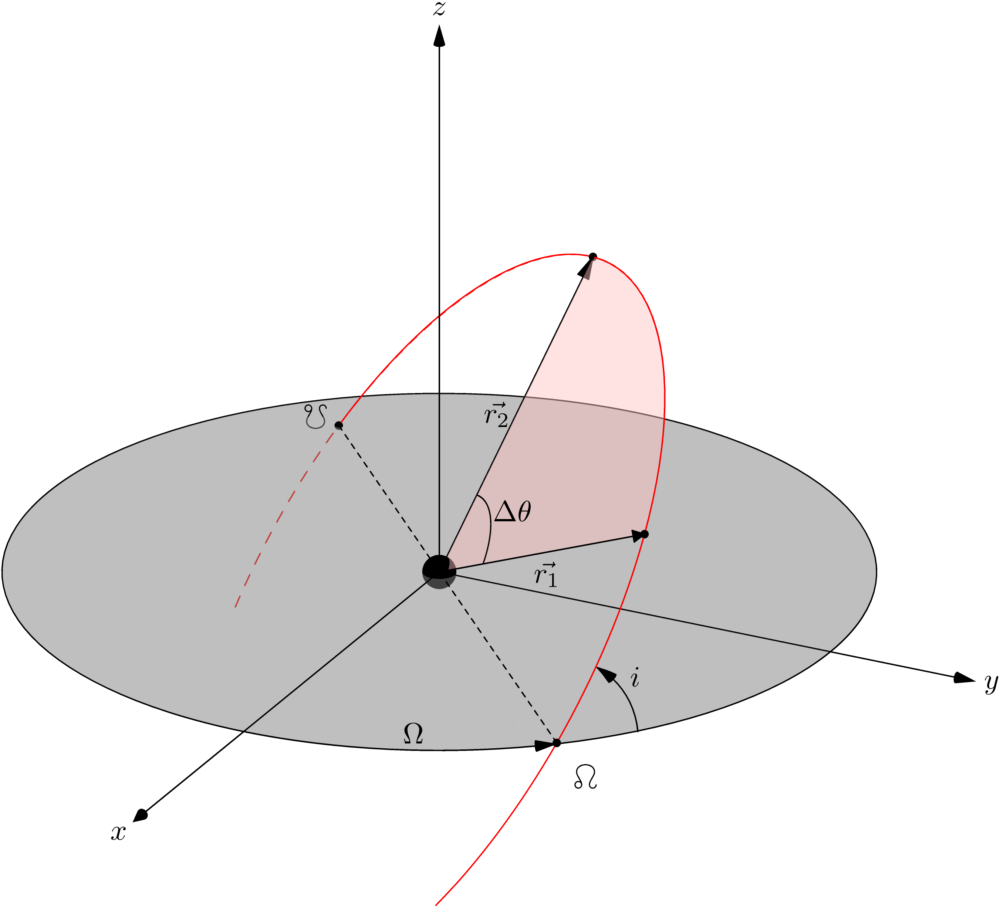

The Lambert's problem
=====================

The Lambert's problem is the boundary value problem of the two-body problem
under the framework of astrodynamics. 

Problem statement
-----------------

The goal is to solve for the orbit of a body being known two of its position
vectors :math:`\vec{r_1}` and :math:`\vec{r_2}`, and the time it takes to travel between
those, usually denoted by :math:`\Delta t`. The geometry of the problem is shown in
the figure below:

Because the problem states to find an orbit, it is usually included within the
*Initial Orbit Determination* (IOD) subject. Nevertheless, Lambert's problem
solution has applications in the field of interplanetary maneuvers and orbital
rendezvous too.
